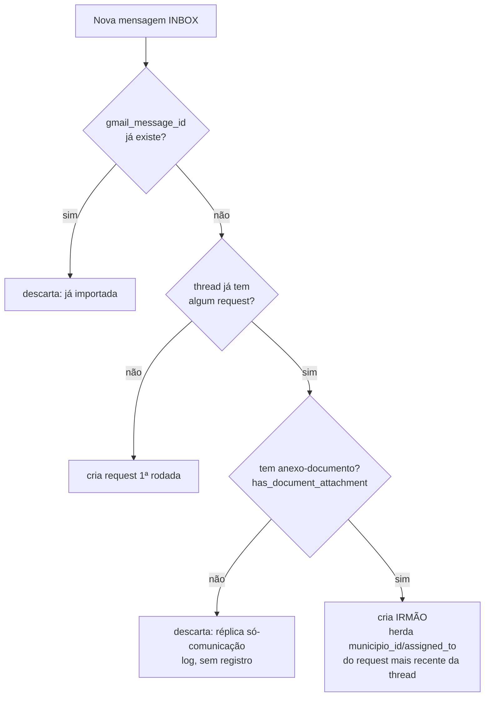

# Plano — Correção do dedup por thread (Variante A: request "irmão" + gate de anexo-documento)

## Context
O `gmail_poller` deduplica e-mails de forma que **respostas novas numa thread já importada
nunca entram** — mesmo trazendo documentos novos (edital, laudo, ata). É descarte silencioso,
não erro.

Confirmado no código:
- `ParecerRequest.gmail_thread_id` é `unique=True` (`backend/app/models/parecer.py:72`; constraint
  criada em `0001_initial.py:71`).
- `_already_imported(thread_id, message_id, db)` (`gmail_poller.py:217`) já descarta por
  **`gmail_thread_id == thread_id` OR `gmail_message_id == message_id`** — basta a thread bater.
- `ingest.py:154` deduplica **só** por `gmail_thread_id`.
- `gmail_webhook.py:70` idem (stub).

Impacto real no piloto: **PAR-2026-0042 (Araripe / Locação SDTS)** foi aprovado sem o
`LAUDO DE AVALIAÇÃO` que veio numa 2ª mensagem da mesma thread — e concluiu justamente pela
"ausência de laudo".

Objetivo: cada nova mensagem **relevante** numa thread vira um `ParecerRequest` próprio (o
escritório emite "SEGUNDO PARECER" como doc distinto), com um **gate** que só ingere a réplica
se ela trouxer anexo de documento (evita poluir a tela com réplicas de comunicação comum).

Decisão de branch (Dr., 2026-07-01): **reconciliar — a entrega-cliente vira a linha de prod**.
Migration nova é **0013 linear sobre 0012** (`down_revision="0012"`, sem multiple-heads).

## Fluxo do dedup (antes → depois)

Antes: qualquer bate em thread → descarta (nó T sempre "sim" levava a SKIP).
Depois: dedup real é por `gmail_message_id`; thread vira só agrupador de rodadas.

## Abordagem

### 1. Modelo — `backend/app/models/parecer.py`
`ParecerRequest`:
- `gmail_thread_id`: trocar `unique=True` por **`index=True`** (vira agrupador de rodadas) — L72.
- `gmail_message_id`: adicionar **`unique=True, index=True`** (nova chave de dedup) — L73.
  NULLs múltiplos são permitidos no Postgres, então requests antigos sem `message_id` não
  conflitam.

### 2. Migration — `backend/alembic/versions/0013_thread_siblings.py` (`down_revision="0012"`)
Não há `naming_convention` na metadata (verificado), então a UNIQUE de `0001` tem o nome default
do Postgres: **`parecer_requests_gmail_thread_id_key`**. Ainda assim, dropar via introspecção para
robustez:
- `upgrade()`:
  - Descobrir o nome real do unique constraint de `gmail_thread_id` via
    `sa.inspect(op.get_bind()).get_unique_constraints("parecer_requests")` e dropá-lo com
    `op.drop_constraint(name, "parecer_requests", type_="unique")`.
  - `op.create_index("ix_parecer_requests_gmail_thread_id", "parecer_requests", ["gmail_thread_id"])`.
  - `op.create_index("ix_parecer_requests_gmail_message_id", "parecer_requests",
    ["gmail_message_id"], unique=True)`.
- `downgrade()`: dropar os 2 índices e recriar a UNIQUE de `gmail_thread_id`
  (`op.create_unique_constraint("parecer_requests_gmail_thread_id_key", ...)`).
- **Backup do banco antes** de aplicar em prod.

### 3. Gate de anexo-documento — novo `backend/app/services/attachment_filter.py`
Módulo compartilhado (poller e ingest usam formatos de meta diferentes → helper recebe pares
`(filename, mime_type)`):
- `DOCUMENT_EXTS = {.pdf,.doc,.docx,.odt,.rtf,.txt,.xls,.xlsx,.csv,.ods}` + prefixos MIME
  correspondentes, **excluindo `image/*`** (logos de assinatura como PNGs não contam como
  documento).
- `is_document_attachment(filename: str, mime_type: str | None) -> bool` — casa por extensão do
  filename OU por prefixo MIME da whitelist; nunca `image/*`.
- `has_document_attachment(pares: Iterable[tuple[str, str | None]]) -> bool`.

### 4. Poller — `backend/app/services/gmail_poller.py`
- `_already_imported`: remover a cláusula de `gmail_thread_id`, ficando
  **`_already_imported(message_id, db)`** (só `gmail_message_id`). Atualizar as 2 chamadas:
  `poll_inbox` (L476) e `_recover_unread_backlog` (L366) — hoje passam `(thread_id, message_id, db)`.
- Novo `_thread_already_imported(thread_id, db) -> bool` (existe request com esse `gmail_thread_id`?).
- Em `_ingest_message`, **após `_collect_attachments` (L252) e antes do download** (os metas já
  têm `mime_type`/`filename`):
  - `is_followup = await _thread_already_imported(thread_id, db)`.
  - Se `is_followup` **e não** `has_document_attachment((m["filename"], m["mime_type"]) for m in
    attachment_metas)` → **descartar**: `logger.info("réplica sem anexo-documento…")`, `return
    False`, sem criar registro.
  - Se `is_followup`: buscar o irmão mais recente
    (`select(ParecerRequest).where(gmail_thread_id==thread_id).order_by(created_at.desc()).limit(1)`)
    e herdar `municipio_id`/`assigned_to` ao construir o novo `ParecerRequest` (L293).
  - Mantém `gmail_thread_id` (agrupador) e `gmail_message_id` (unique). O `except IntegrityError`
    do `db.flush()` (L307) passa a proteger corrida por `gmail_message_id`.
- Segurança já OK: respostas do próprio escritório saem com label SENT (não INBOX) → o filtro de
  L471 (`"INBOX" in labels`) não as pega; pipeline não envia e-mail.

### 5. Ingest .eml — `backend/app/routers/ingest.py`
- Dedup por **`gmail_message_id`** (L154-158), não `gmail_thread_id`. `thread_id`
  (= `In-Reply-To` ou `message_id`, L151) segue como agrupador.
- Mesmo gate reusando `has_document_attachment` sobre `attachments_meta`
  (`_collect_attachments` já devolve `(filename, content_type, bytes)` — passar
  `(filename, content_type)`): se a thread já existe e não há anexo-documento → `409 "réplica sem
  documento"`.
- Se a thread já existe e há documento: herdar `municipio_id`/`assigned_to` do irmão mais recente
  ao construir o `ParecerRequest` (L201).

### 6. Webhook — `backend/app/routers/gmail_webhook.py` (baixa prioridade)
É um **stub**: usa `historyId` como chave de thread e **não baixa a mensagem/anexos**. Não é o
caminho de prod (o poller roda a cada 5 min). v1: alinhar o dedup para `gmail_message_id` (L70-75)
por consistência e **anotar** com comentário que ele precisa ser reescrito para buscar a mensagem
real (aplicar o gate) antes de virar caminho de produção — reescrita fora do escopo.

### 7. Frontend — agrupamento por thread (**requer pequena mudança de API — corrige premissa do draft**)
O endpoint de lista usa o `ParecerRequestOut` **local do router** (`backend/app/routers/parecer.py:68`),
que **não** inclui `gmail_thread_id` (o `ParecerRequestOut` de `schemas/parecer.py` inclui, mas
não é o usado pela lista). Então:
- **Backend**: adicionar `gmail_thread_id: Optional[str] = None` ao `ParecerRequestOut` de
  `routers/parecer.py:68`. `from_parecer` usa `model_validate(pr)` (from_attributes) → o campo é
  populado automaticamente, sem outra mudança.
- **Frontend types** `frontend/src/types/parecer.ts`: adicionar `gmail_thread_id: string | null` à
  interface `ParecerRequest`.
- **`ParecerList.tsx`**: agrupar `sorted` por `gmail_thread_id` (só quando não-nulo) para computar,
  por item, `{ rodada, total }` da thread (ordenar por `created_at` asc). Passar essa info ao card.
  Manter a lista atual (não colapsar) — só anotar a rodada.
- **`ParecerCard.tsx`**: badge discreto "rodada N/M" ao lado dos badges de status/tema, exibido
  **apenas quando `total > 1`**, para os irmãos não parecerem duplicata.

### 8. Testes — `backend/tests/`
Seguir os padrões existentes:
- **Unit** do gate em `backend/tests/unit/services/` (novo `test_attachment_filter.py`):
  `is_document_attachment`/`has_document_attachment` — whitelist por extensão e MIME, exclui
  `image/*`.
- Estender `backend/tests/unit/services/test_gmail_poller.py`: `_thread_already_imported` e o novo
  `_already_imported(message_id, db)` com `db` mockado (AsyncMock, padrão do conftest).
- `_ingest_message` com service/db mockados: (a) 1ª msg da thread cria request mesmo sem anexo;
  (b) réplica sem doc é descartada (`return False`, nenhum `db.add(ParecerRequest)`); (c) réplica
  com PDF vira irmão herdando `municipio_id`/`assigned_to` do mais recente.
- Ingest .eml em `backend/tests/integration/routers/`: réplica sem doc → 409; réplica com doc →
  201 herdando município (usar os helpers de `.eml` já no conftest).

## Fora de escopo (anotar, não implementar)
- **Remediar o PAR-2026-0042 concreto** (anexar o laudo da MSG 2 `19f1375728c03bfd`, hoje no TRASH,
  ao request existente + regerar). Este fix previne casos FUTUROS; o caso já aprovado é remediação
  manual separada.
- Reescrita do webhook para buscar a mensagem real e aplicar o gate.

## Verificação
- `cd backend && alembic upgrade head` sobe 0013 limpo; `alembic downgrade -1` reverte. Conferir
  `\d parecer_requests`: `gmail_message_id` unique index, `gmail_thread_id` só index (sem UNIQUE).
- `pytest backend/tests/ -k "poller or ingest or attachment"`.
- Repro do caso Araripe (dump de prod, thread `19f134d3ac802447`): injetar as 2 mensagens →
  MSG 1 cria request; MSG 2 (com o laudo `.pdf`) cria **irmão** herdando município; uma réplica
  só-texto é descartada.
- Smoke no frontend: 2 requests na mesma thread aparecem na lista, cada um com badge "rodada N/M".

## Deploy (reconciliação)
1. **Backup do banco de prod** (a 0012 já dropa tasks/movements/holidays; 0013 mexe em constraint).
2. Publicar `entrega-cliente` como nova linha de prod (merge/fast-forward em `master`), incluindo o
   commit do 0013.
3. Prod: `git pull` + `docker compose -f docker-compose.prod.yml up -d --build` (full, pois a 0012
   muda schema/serviços). nginx/certbot preservados.
4. Validar `GET /api/gmail/status` = `connected` e rodar um ciclo de poll.